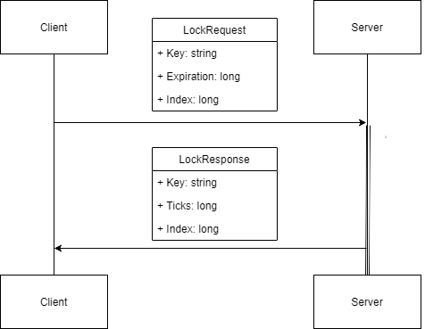
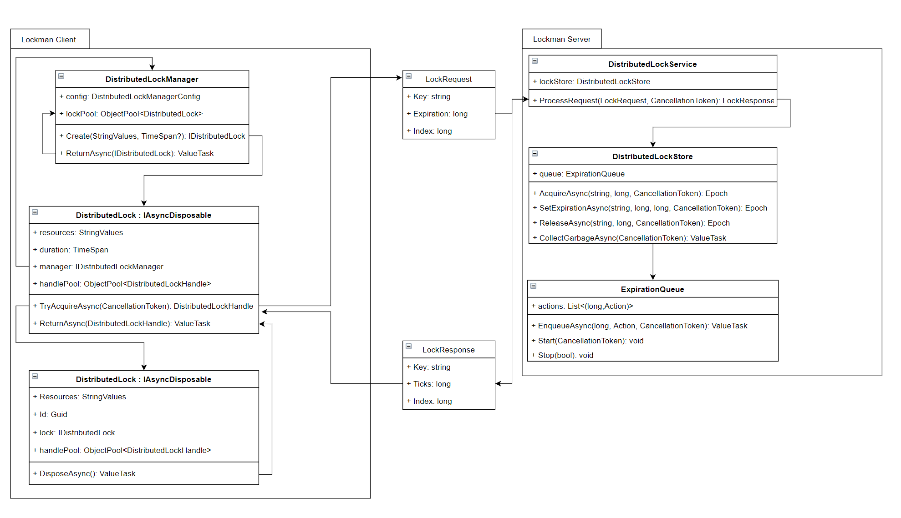

# Lokman

Main concepts:

* `Expiration` can be `long.MaxValue`, if so lock will be blocked with infinity lifetime.
if it is `0` or less than the current server tick clock, the lock will be released.
It isn't a duration, it is the ticks in **server time** when this lock will be released.
* An `Index` is a monotonously increasing number. Each update operation must update the index number too.
* Tuple of `(long Index, long Ticks)` called `Epoch`.  
* For syncronization with server time you can get a fake lock with predefined name `PREDEFINED LOCK NAME HERE` which always will be "acquired". But you don't need get the server time each acquire request, because client lib should have logic for keeping time in sync with minimal request as possible.

## Class diagram (OUTDATED)

